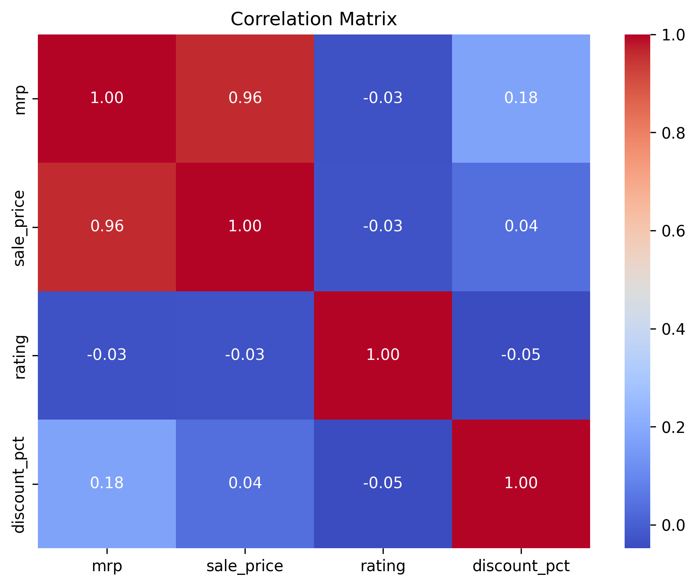
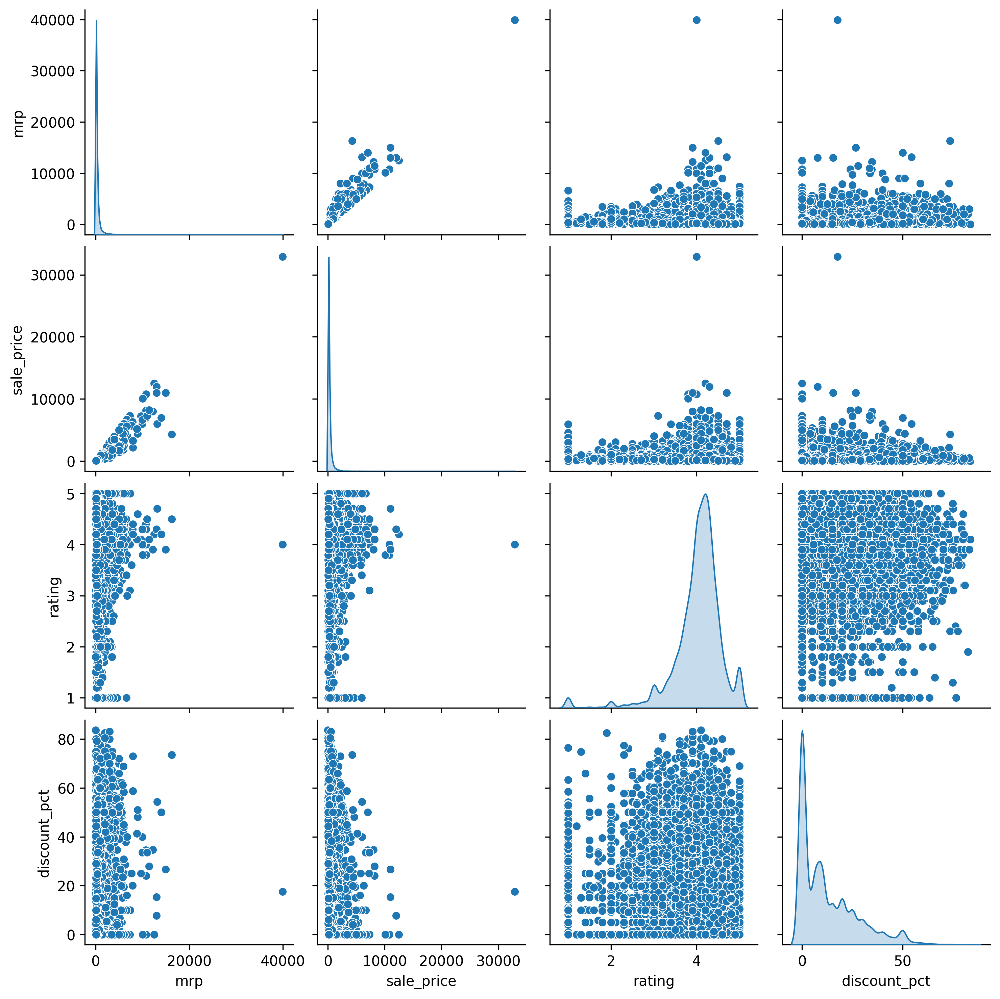

# 🛒 SmartBasket Analysis
### Exploratory Data Analysis of Indian E-Commerce Grocery Platforms


---

## 📌 Project Overview

SmartBasket Analysis is an Exploratory Data Analysis (EDA) project that compares pricing, discounts, customer ratings, and product availability across India's leading online grocery platforms:

- BigBasket
- Blinkit
- JioMart
- Zepto

The project analyzes **39,426 grocery product listings** to uncover meaningful business insights that can support pricing strategies, inventory planning, and customer-focused decision-making.

---

# 🎯 Objectives

- Compare product pricing across different platforms.
- Analyze customer rating patterns.
- Study discount strategies.
- Identify high-performing product categories.
- Explore brand-level performance.
- Discover relationships among numerical features.
- Generate actionable business insights.

---

# 📊 Dataset Information

| Attribute | Details |
|-----------|----------|
| Raw Records | 39,426 |
| Features | 9 |
| Platforms | BigBasket, Blinkit, JioMart, Zepto |
| Dataset Type | Structured CSV |
| Domain | E-Commerce Grocery |

### Dataset Features

- Product Name
- Platform
- Category
- Sub Category
- Brand
- MRP
- Sale Price
- Rating
- Discount Percentage

---

# 🛠 Technology Stack

| Category | Tools |
|-----------|-------|
| Programming | Python |
| Data Manipulation | Pandas, NumPy |
| Visualization | Matplotlib, Seaborn |
| Development | Jupyter Notebook |
| Version Control | Git & GitHub |

---

# 🔄 Project Workflow

```
Raw Dataset
      │
      ▼
Data Understanding
      │
      ▼
Data Quality Assessment
      │
      ▼
Data Cleaning & Preprocessing
      │
      ▼
Outlier Detection
      │
      ▼
Exploratory Data Analysis
      │
      ▼
Business Insights
      │
      ▼
Business Recommendations
```

---

# 📂 Repository Structure

```
SmartBasket-Analysis
│
├── data
│   ├── combined_grocery_dataset.csv
│   └── modified_dataset.csv
│
├── notebook
│   └── SmartBasket_Analysis.ipynb
│
├── presentation
│   └── SmartBasket_Analysis.pptx
│
├── images
│
├── README.md
├── requirements.txt
├── LICENSE
└── .gitignore
```

---

# 📈 Exploratory Data Analysis

The project addresses the following business questions:

1. How does the distribution of product sale prices differ across platforms?
2. Which product categories contribute the highest total sales value?
3. What is the overall distribution of product sale prices?
4. Which platform exhibits the greatest variation in product prices?
5. How are customer ratings distributed across different platforms?
6. Is there a relationship between MRP and Sale Price?
7. Do products with higher discounts generally have lower selling prices?
8. Which numerical variables are strongly correlated?
9. How do all numerical variables interact with one another?
10. What is the relationship between Sale Price and Customer Rating?
11. Which platform contributes the largest share of the overall product catalogue?
12. Which categories exhibit the highest variability in product prices?
13. How are products distributed across categories and platforms?
14. Which brands provide the best balance between ratings and discounts?
15. How are customer ratings distributed overall?

---

# 📊 Visualizations Used

- FacetGrid
- Histogram
- Box Plot
- Violin Plot
- Scatter Plot
- Regression Plot
- Correlation Heatmap
- Pair Plot
- Joint Plot
- Pie Chart
- Boxen Plot
- Stacked Bar Chart
- Bubble Plot
- KDE Plot

---

# 📸 Project Screenshots

### Correlation Heatmap



---

### Pair Plot



---

# 💡 Key Business Insights

- Beauty & Hygiene contributes the highest overall sales value.
- BigBasket offers the widest product portfolio across multiple price ranges.
- Blinkit provides the highest average discounts.
- Zepto records the highest average customer ratings.
- MRP and Sale Price exhibit a strong positive correlation.
- Customer ratings remain consistently high regardless of product pricing.
- Premium products frequently receive higher discount percentages.
- Categories with greater price variability cater to both budget and premium customers.

---

# 📌 Business Conclusion

The analysis demonstrates that product pricing, discount strategies, and category selection significantly influence product performance across Indian online grocery platforms. Businesses can leverage these insights to optimize pricing strategies, improve inventory planning, and prioritize high-performing product categories while maintaining customer satisfaction.

---

# 🚀 Future Scope

This project can be extended by incorporating:

- Machine Learning models for price prediction
- Product recommendation systems
- Demand forecasting
- Customer segmentation
- Interactive dashboards using Power BI or Tableau
- Real-time price comparison across platforms

---

# ▶️ How to Run

Clone the repository

```bash
git clone https://github.com/YOUR_USERNAME/SmartBasket-Analysis.git
```

Navigate to the project folder

```bash
cd SmartBasket-Analysis
```

Install dependencies

```bash
pip install -r requirements.txt
```

Launch Jupyter Notebook

```bash
jupyter notebook
```

Run all cells in **SmartBasket_Analysis.ipynb**.

---

# 📦 Requirements

```
pandas
numpy
matplotlib
seaborn
jupyter
```

---

# 👩‍💻 Author

**Bhumi Paliwal**

B.Tech Computer Science

Aspiring Data Analyst | Python | SQL | Machine Learning | Data Visualization

---

## ⭐ If you found this project useful, consider giving it a Star!
